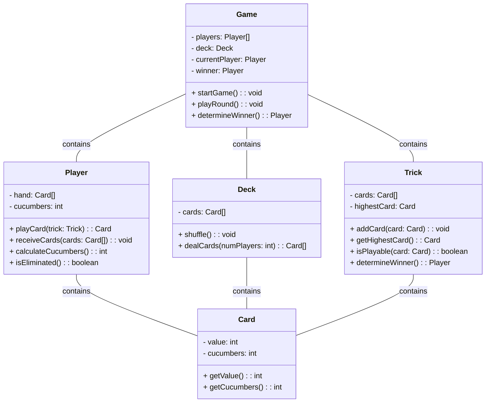

# README

[](https://zeabur.com?referralCode=noracami&utm_source=noracami)

## Introduction

This is a web game service for the game "Five Cucumbers".

Integrate with the GAAS(Game As A Service) platform. link: https://lobby.gaas.waterballsa.tw/

## [Rule](./doc/rule.md)

## Class Diagram

> generated by chatgpt: https://chat.openai.com/share/3acfea14-6dce-44a8-bb74-2cb31ef08240



## Integration Requirements

大平台出版整合文件

https://waterball.notion.site/v1-1-0-4020a50d26014f829492147af37db06f

### 1. 到大平台註冊遊戲 ✔️

<details>
  <summary>▶︎ example</summary>

```json
// POST /games
// Host: https://api.gaas.waterballsa.tw
// Authorization: Bearer {遊戲開發者的JWT}

{
  "uniqueName": "fivecucumber",
  "displayName": "黃瓜五兄弟",
  "shortDescription": "It is a trick-taking game with the goal of NOT winning the last trick!",
  "rule": "Try to avoid getting cucumbers more than 5, or you are out!",
  "imageUrl": "https://gaas-five-cucumbers.zeabur.app/watermelon.png",
  "minPlayers": 1,
  "maxPlayers": 6,
  "frontEndUrl": "",
  "backEndUrl": "https://gaas-five-cucumbers.zeabur.app/api"
}
```

</details>

### 2. 遊戲後端實作「心跳」API ✔️

### 3. 遊戲後端實作「開始遊戲」API ✔️

> 輸入：房間 ID、玩家資訊
> 輸出：遊戲連結(提供給 IFrame 顯示遊戲畫面)
> Detail see below

<details>
  <summary>▶︎ request</summary>

```json
// POST /games
// Host: {你的後端主機}
// Authorization: Bearer {房主的Jwt}

{
  "roomId": "room_385abe92e39a3",
  "players": [
    {
      "id": "6497f6f226b40d440b9a90cc",
      "nickname": "板橋金城武"
    },
    {
      "id": "6498112b26b40d440b9a90ce",
      "nickname": "三重彭于晏"
    },
    {
      "id": "6499df157fed0c21a4fd0425",
      "nickname": "蘆洲劉德華"
    },
    {
      "id": "649836ed7fed0c21a4fd0423",
      "nickname": "永和周杰倫"
    }
  ]
}
```

</details>

<details>
  <summary>▶︎ response</summary>

```json
{
  "url": "https://{你的前端主機}/games/{gameId}"
}
```

</details>

### 4. 實作 JWT 驗證 ✔️

> use auth0 SDK to verify jwt
> https://auth0.com/docs/quickstart/backend/rails/interactive

### 5. 呼叫大平台 API `GET /users/me` 📝

> 透過大平台的 JWT 取得玩家資訊（例如：暱稱、id）

### 6. 遊戲前端實作「開始遊戲」頁面 🚧

> 玩家會透過 IFrame 訪問 `3. 開始遊戲` API 回傳的 URL，加上 `?jwt={玩家的 JWT}` 參數
> 遊戲後端藉由 JWT 判斷玩家身份

### 7. 遊戲後端實作「結束遊戲」API ✔️

> [!IMPORTANT]
> request body must be explicitly empty

<details>
  <summary>▶︎ request</summary>

```ruby
url = 'https://api.gaas.waterballsa.tw'
token = ANY_OF_GAME_PLAYER_JWT
HTTPX.plugin(:auth).bearer_auth(token).post(url, body: '')
```

</details>

## backlog

1. bind jwt and user info
2. check cookie in iframe

## endpoint

https://gaas-five-cucumbers.zeabur.app/
